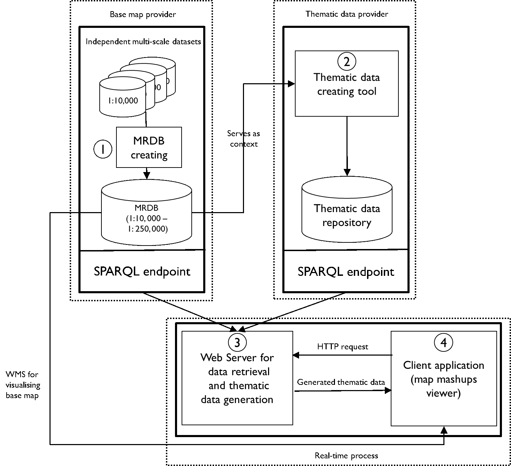

# Linked Data-based relative positioning

This project is an open source implementation of the Linked Data-based relative positioning for geospatial data. The initial aim of the methodology is to alleviate the unsynchronised level of detail in web maps. For details, one could refer to the paper [Synchronising geometric representations for map mashups using relative positioning and Linked Data]( https://doi.org/10.1080/13658816.2018.1441416)
## The architecture of the system:

Please note that in our implementation, we adopted [Stardog](https://www.stardog.com/) as RDF store and it provides SPARQL endpoints used in the system. In the implementation, the server retrieves data from the HTTP SPARQL endpoints, which means that the RDF store can be substituted by another one, as long as the HTTP SPARQL endpoint is supported by the RDF store; otherwise one could rewrite the data retrieval part.
## Content
The implementation comprises several modules, and each module is in a separated folder:
Ontologies: two ontologies, i.e. base map ontology and thematic data ontology;
Web Application: web application for real time process where the thematic featrues are assembled, including the server and client sides; The open source Python web framework – [Django]( https://www.djangoproject.com/) is used.
RDF convertor for base maps: converting shapefiles of base maps to RDF in Turtle;
Thematic data digitalisation tool: an ArcGIS Python addin where the thematic features are created using relative positioning.
## Contact:
	Weiming Huang
	GIS Centre
	Department of Physical Geography and Ecosystems Science
	Lund University
	Sölvegatan 12
	SE-223 62 Lund
	Sweden
	Email: weiming.huang@nateko.lu.se
